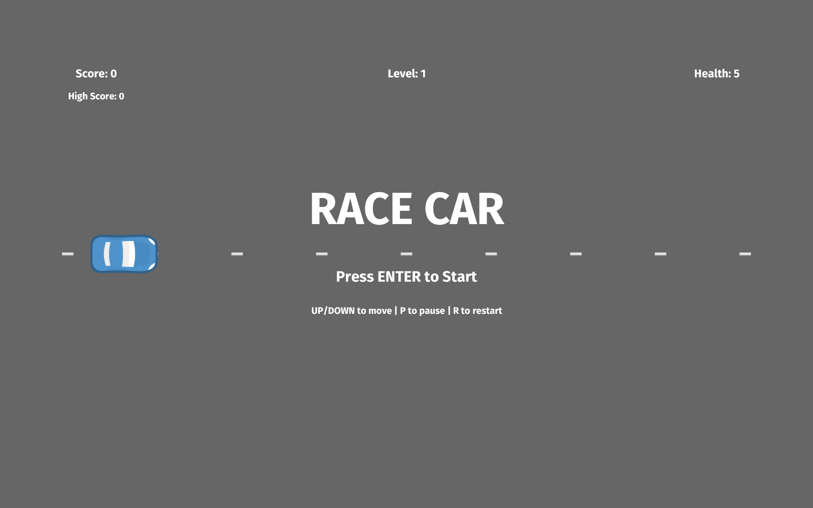

# Race Car

2D top-down racing game built in Rust using the [rusty_engine](https://github.com/CleanCut/rusty_engine) game engine — dodge obstacles, collect power-ups, survive as long as possible and chase the high score.



## Gameplay

- Dodge barrels, cones, and barriers scrolling towards you
- Each collision costs 1 health point (start with 5, max 8)
- Hit 0 health or go out of bounds → Game Over
- Difficulty ramps up over time: obstacles get faster and more numerous
- Score increases with survival time + bonus for every obstacle dodged
- Level up every 500 points

**Controls**

| Key | Action |
|-----|--------|
| `↑` / `↓` | Move car up / down |
| `Enter` | Start game (from menu) |
| `P` | Pause / Resume |
| `R` | Restart |

## Features

- **Power-up system** — collect rolling balls for health restore, temporary shield, or speed boost
- **Difficulty progression** — road speed increases every 10s; new obstacles spawn every 15s (up to 12)
- **Scoring & levels** — time-based score + dodge bonus; level displayed on HUD
- **High score tracking** — persists across restarts within a session
- **Game states** — Menu → Playing → Paused → Game Over with full restart support
- **Shield mechanic** — absorbs hits for 5 seconds; car pulses while active
- **Speed boost** — 1.6x player speed for 4 seconds
- **Rich HUD** — health, score, level, high score, active power-up timers
- **Sprite-based 2D rendering** with collision detection
- **Background music + sound effects** (OGG)
- **Delta-time movement** for consistent speed at any frame rate

## Build & Run

```bash
# Requires Rust toolchain (https://rustup.rs)
cargo run --release
```

## Tech Stack

- **Rust** 2021 edition
- **rusty_engine** 5.2 — 2D game engine (sprites, audio, collisions, input)
- **rand** — random obstacle / power-up placement

## Project Structure

```
src/
├── main.rs          # Entry point, game loop orchestration, phase transitions
├── constants.rs     # All tunable game parameters in one place
├── game_state.rs    # GameState struct, Phase enum, PowerUpKind enum
├── player.rs        # Player sprite setup and movement logic
├── road.rs          # Scrolling road-line setup and update
├── obstacles.rs     # Obstacle spawning, recycling, dynamic scaling
├── powerups.rs      # Power-up spawning, collection, timer management
├── collisions.rs    # Collision event processing (obstacles + power-ups)
├── difficulty.rs    # Speed ramp and level progression
├── scoring.rs       # Score accumulation (time + dodge bonus)
└── hud.rs           # All on-screen text: HUD, menu, pause, game over
assets/
├── sprite/racing/   # Car, barrel, barrier, cone sprites + colliders
└── audio/
    ├── music/       # Background tracks (OGG)
    └── sfx/         # Sound effects (impact, jingle, etc.)
```
